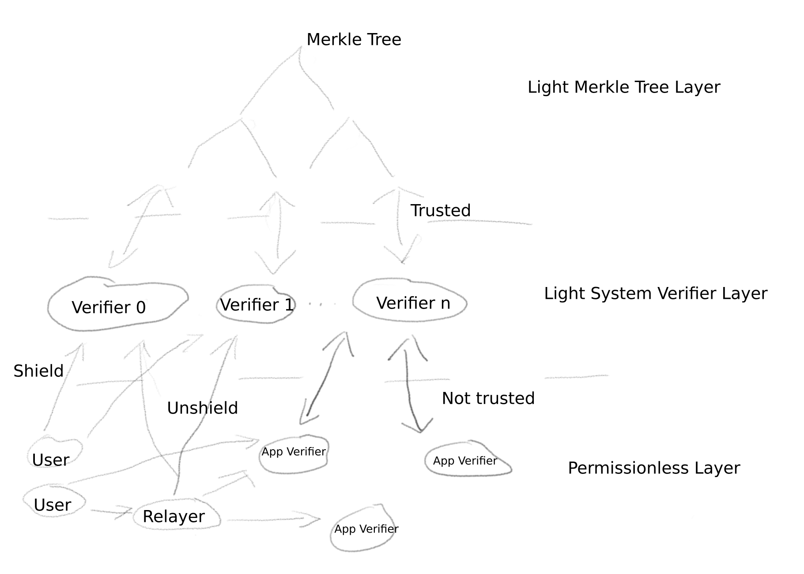

# Mock App Verifier

This repo serves as a minimal testcase to test verifier_program_two which can only be invoked via cpi.

Additionally, this repo can be used as a template to build a private Solana program.

A private Solana program consists out of a circuit which encodes the application logic and a verifier Solana program.
This program


- Private application logic
- shielded assets
- fees can be paid in shielded assets to a relayer


To interact with the verifier program the light-sdk Transaction class takes care of the inputs.


## Prerequisites:
- Circom // TODO: add links
- Anchor // TODO: add links
- Light Protocol Architecture // TODO: add links


# Light Protocol Architecture

The essence of Light Protocol is a set membership proof and nullifiers. A set membership proof is a zero knowledge proof which proves that a leaf, which is the hash(commitment) of a utxo, belongs to a merkle tree by proving the root of the merkle tree as public input. These proofs in combination with checks that no new tokens are created out of thin air are verified in system verifiers. Nullifiers uniquely identify a utxo without revealing any information of it and are saved to prevent double spents of a utxo. Additional logic can be specified in a utxo and is enforced by a specific application verifier program. System and application verifiers are connected by both exposing a hash over all utxos used in the transaction which is checked by the executing both verifier programs.




1. Merkle tree program
2. System verifiers programs
3. Application verifiers programs

### 1. Merkle tree:
Light protocol consists out of a merkle tree program, and it's pdas which store merkle tree state.
This state is accessible to multiple system verifier programs.
The merkle tree program trusts the system verifiers and does not enforce checks.

- stores commitment hashes of utxos as it's leaves to enable zk set membership proofs
- is one Solana program which can instantiate new merkle trees
- the merkle tree state is saved in a pda
- tree height 18 -> 256k leaves
- always inserts pairs of leaves
- a leaves pda stores 2 commitment hashes, the merkle tree public key, 256 bytes (can be used to store encrypted Utxos)
- a new merkle tree will be created when the current tree is full


### 2. System Verifiers:
System verifiers, verify basic Light transactions. Light transactions invalidate and create shielded utxos.
- Implemented in one Solana program each
- Verify the integrity utxos and their set membership in the merkle tree.
- are trusted by the merkle tree program
- call the merkle tree program to insert leaves, transfer funds, insert nullifiers
- A nullifier is derived deterministically from a utxo while not revealing any information about it. In other words a nullifier is an identifier for a utxo which is emitted by a proof and saved in a solana account. At proof verification the program checks whether the nullifier emitted by the proof already exist, if not inserts the nullifier. Therefore, every utxo committed to the merkle tree can only be used once in a proof.

System verifiers can differ in 4 parameters:
- number of input utxos
- number of output utxos
- number of checked inputs
- support app utxos

Deployed system verifiers:

- Verifier Zero:
    - 2 input utxos
    - 2 output utxos
    - no app utxo support

- Verifier One:
    - 10 input utxos
    - 2 output utxos
    - no app utxo support

- Verifier Two:
    - 4 input utxos
    - 4 output utxos
    - 2 checked inputs (these two inputs are the connecting hash and the verifier public key)
    - app utxo support

### 3. Application Verifiers/Private Solana Programs (PSP):

Application Verifiers are custom verifier programs, which can enforce any logic programmers encode in their circuits. System and application verifiers are connected by both exposing a hash over all utxos used in the transaction which is checked by the executing both verifier programs. Although these utxo inputs are shared by both proofs, application verifiers do not verify these utxos and do not have access to the merkle tree. Only system verifiers validate the transactions utxos and update the merkle tree plus liquidity pools accordingly. This way application verifiers do not represent a security risk for Light Protocol, since the integrity of transactions is secured by system verifiers. An application verifier is essentially a private solan program. Anyone can deploy it with their own custom logic and all computation is private by default.

Currently only circom and Groth16 libraries are provided to build application verifiers. But such verifiers can be written in any language and verified by any proving system as long as the setup can compute the connecting hash.


### 4. Relayer:

The relayer relays transactions on behalf of users in exchange for a fee. This is necessary for anonymous transfers and unshields, because an entity needs to pay the fees for the solana transaction to conduct the light transaction up front. A users do not want to do this themselves because they would dox themselves by using a their own wallet. As a neutral third party a relayer solves this issue. Because all transaction data is included in the zero knowledge proof the relayer receives users do not need to trust the relayer. If the relayer tries to alter any parameter of a transaction it is entrusted to relay the transaction will be rejected by the invoked system verifier.
In detail the relayer, receives json serialized instructions from the user's client, and returns the user a transaction signature on successful relaying of the transaction.

### 5. Light Transaction Details

Light Protocol features custom keypairs and uses a utxo model. These utxos are programmable. The programmable logic is enforced by custom application verifiers the described before.

A transaction contains a number of input and output utxos. The circuit checks
System verifiers verify specific instantiations of the light protocol circuit.
Variations are the number of input and output utxos.


**Anatomy of a Light Transaction:**

// TODO: make graphic


0. Instance:
- anchor client
- lookuptable
- relayer


->

1. Transaction Parameters:
- select utxos / generate a new one
- specify system verifier
- 

->

1. App Transaction Parameters:
- generate app custom parameteres
- specify app verifier

->

2. compile:
- shuffle utxos (to make encrypted utxos onchain more random)
- add empty utxos until the number of input and output utxos for the specified system verifier is reached
- create proof inputs:
    - calculate public and fee amounts
    - get merkle proofs for input utxos
    - get rootIndex from the merkle tree onchain in which input utxos are inserted
    - get all paramaters of every utxo
->

3. prove:
- calculate proof for the system verifier
- create public inputs for system verifier

->

3. prove app:
- calculate proof for the app verifier
- create public inputs for app verifier

-> 

4. getInstructions:
- generate instructions for the specified system or app verifier program

-> 

5. sendTransaction:
- if deposit send
- if transfer or withdrawal send to relayer which sends transaction

->

6. (0) app verifier
- if an input utxo is an application utxo
- takes two transactions to complete (1st tx send data, 2nd send data etc..)
- verifies it's proof
- calls an app enabled system verifier via cpi

-> 

6. (1)sytem verifier
- verifies the proof
- calls the merkle tree via cpi

-> 

6. (2)merkle tree:
- leaves are stored into leaves pdas
- leaves are committed to but not inserted in the merkle tree
- nullfiers are inserted, by creating a pda derived from the nullifier
- asset amounts are transferred
- the relayer is paid

-> result

Input utxos are spent and new utxo are committed to the merkle tree.
A separate process updates the merkle tree, inserts the leaves, thus finalizes the transaction. After insertion into the merkle tree the now inserted output utxos can be spent in a future transaction.


**Merkle Tree Update:**

Can be conducted by the user at deposit, but in general will be conducted by a relayer.

Steps:
1. initialize update state:
    - creates the temporary state pda which will store the state of the computation necessary to compute the poseidon hashes to update the merkle tree
    - copies sub trees from the merkle tree pda to the temporary state pda
    - copies a batch of up to 16 leaves pdas to the temporary state
2. compute:
    - computes poseidon hashes and stores temporary state in the update state
    - sends at least ~30 transactions, 3 instructions per poseidon hash 18 times + additional transactions for batch insertions
3. insert root:
    - finalizes the merkle tree update by inserting the new root
    - closes every leaves pda of the batch of leaves which have been inserted into the merkle tree now
    - stores the data of every leaves pda in a compressed solana account
    - closes the temporary state pda

**Transaction Primitives:**

The key building blocks for a Light transaction are shielded keypairs and utxos. Every utxo stores which assets and which amounts of these assets it represents. The utxo is tied to a keypair which is necessary to spend the utxo because it's public key is part of the commitment hash and the circuit of the ZKP expects it's signature to be part of the nullifier.


**Keypair:**
- Attributes:
    - shielded keypair {
        - privkey
        - public key = PoseidonHash(privkey)
    }
    - encryption keypair (salsa20)

- Methods:
    - derivation:
        - seed is generated with a ed25519 signature of the message: "",
        - privkey = blake2bHash(seed + "shielded");
        - encryptionPrivkey = blake2bHash(seed + "encryption");
    - signature:
        - signature = poseidonHash(privKey, input1, input2);


**Utxo:**
A utxo can hold two balances, one balance in sol, the fee token, and one balance in an arbitrary spl token.

- Attributes:
    - **amounts:**
        array of amounts corresponding to the assets
    - **assets:**
        array of a number of asset publickeys the first asset is always sol, the other asset can be any registered spl asset including an NFT
    - **blinding:**
        random 31 bytes number to mask the commitment hash
    - **shielded keypair:**
        privateKey and publicKey = PoseidonHash(privateKey)
    - **instructionType:**
        the hash of app data defined by an application verifier
    - **pool type:**
        the pool type the assets have been deposited in when shielded
    - **verifier public key:**
        the public key of the app verifier which can spend this utxo, is 0 for normal transactions in system verifiers
- Methods:
    - **getCommitmentHash():**
        generates the commitment hash from the utxo attributes. This hash is inserted into the merkle tree onchain.
        commitment = poseidonHash(
            AmountsHash,
            Keypair.publicKey,
            Blinding,
            AssetsHash,
            InstructionType,
            PoolType,
            VerifierPubkey,
        )
        AmountsHash = poseidonHash(amount[0], ..., amount[n]);
        AssetsHash = poseidonHash(asset[0], ..., asset[n]);
    - **getSignature():**
        signature = Keypair.signature(privkey, commitment, merkleTreeLeafIndex);
    - **getNullifierHash():**
        nullifierHash = poseidonHash(commitment, merkleTreeLeafIndex, signature);

**Circuit Overview:**

The circuit takes utxo parameters for input and output utxos as inputs.
Additional, public inputs are:
- merkle tree root
- mint
- public amount (spl token amount which is deposited or withdrawn)
- fee amount (sol amount which is deposited or withdrawn)
- integrity hash (hash over data which is checked in program)
- 
It proves that all input utxos which are non zero are 

```
Inputs Utxos 
CommitmentHash[0](utxo_inputs)
.           -> check commitmments are in Merkle tree
.           -> sumIn[nrAssets] for every asset
CommitmentHash[n](utxo_inputs)

Output Utxos
CommitmentHash[0](utxo_inputs)
.           -> sumOut[nrAssets] for every asset
.
CommitmentHash[m](utxo_inputs)

SumChecks:
- sumIn[0] = sumOut[0] + feeAmount
- sumIn[1] = sumOut[1] + publicAmount
```
OtherChecks:
- the variables publicAmount and feeAmount are public and tell the verifier program what amounts are deposited to or withdrawn from the liquidity pools
- the mint variable is public as well and specifies the asset for deposits/withdrawals determined by the public amount variable.
- IntegrityHash, is computed onchain to include inputs which are not part of utxos in the proof. This way these inputs can be enforced by a verifier program while a relayer can submit a transaction on our behalf. Because all public parameters are included in the proof we do not need to trust the relayer. If the relayer changes any parameter no system verifier will verify the proof successfully, in other words the protocol will reject the transaction.

Keccak256 Hash(
    recipient, // spl token recipient
    recipientFee, // sol recipient
    relayer publickey, // signer/relayer public key
    relayer fee,
    encrypted utxos // encrypted utxos or other data to be stored onchain
)


### Example shield transaction:

Counterintuitively when you deposit to Light, you need to define an output Utxo.
This is because we do not have any utxos inserted in the merkle tree yet.
Because we do not have any input utxos to pass the sum check the public amount needs to be the same amount as the deposit utxo. The compilation step in the Transaction class takes care of defining public inputs such as the public amount.

```
// This will not execute
const poseidon = await circomlibjs.buildPoseidonOpt();
// spl token deposit amount
let depositAmount = 10;
// sol deposit amount in lamports
let depositFeeAmount = 1_000_000_000;

const lightKeypair = new Keypair({poseidon});

let lightInstance: LightInstance = {
    solMerkleTree: new SolMerkleTree({pubkey: MERKLE_TREE_KEY, poseidon}),
    lookUpTable: LOOK_UP_TABLE,
    provider,
};

let tx = new Transaction({
    instance: lightInstance,
    payer: ADMIN_AUTH_KEYPAIR,
    shuffleEnabled: false,
});

const deposit_utxo = new Utxo({
    poseidon,
    assets: [FEE_ASSET, MINT],
    amounts: [
        new anchor.BN(depositFeeAmount),
        new anchor.BN(depositAmount),
    ],
    keypair: lightKeypair,
});

let txParams = new TransactionParameters({
    // notice that at a deposit the new utxo needs to be provided as output utxo such that it is inserted into the merkle tree
    // since there are no input utxos provided the compilation will add the deposit utxo's amounts as public and fee amounts to the public inputs
    outputUtxos: [deposit_utxo],
    merkleTreePubkey: MERKLE_TREE_KEY,
    sender: userTokenAccount,
    senderFee: solanaPayer.publicKey,
    verifier: new VerifierZero(),
});

await tx.compileAndProve(txParams);
const transactionSignature = await tx.sendAndConfirmTransaction();
console.log(transactionSignature);
```

### Example unshield transaction:
Input utxos must have been inserted in the merkle tree before with a light transaction.


```
// This will not execute
const poseidon = await circomlibjs.buildPoseidonOpt();
let merkleTree = await SolMerkleTree.build({pubkey: MERKLE_TREE_KEY, poseidon})
// fetches all inserted leaves from a given merkle tree pubkey
let leavesPdas = await SolMerkleTree.getInsertedLeaves(MERKLE_TREE_KEY);

// finds unspent utxos of a given shielded keypair by attempting to decrypt the storage every leaves pda, returns the first successfully decrypted utxo
let decryptedUtxo = await getUnspentUtxo(
    leavesPdas,
    provider,
    KEYPAIR,
    POSEIDON,
    merkleTreeProgram,
    merkleTree.merkleTree,
    0
);

const origin = new anchor.web3.Account();
var tokenRecipient = recipientTokenAccount;

let lightInstance: LightInstance = {
    solMerkleTree: merkleTree,
    lookUpTable: LOOK_UP_TABLE,
    provider,
};

let relayer = new Relayer(
    ADMIN_AUTH_KEYPAIR.publicKey,
    lightInstance.lookUpTable,
    SolanaKeypair.generate().publicKey,
    // relayer fee (is subtracted from the withdrawn sol amount)
    new BN(100000)
);

let tx = new Transaction({
    instance: lightInstance,
    // notice for a withdrawal or transfer we need to use a relayer
    relayer,
    shuffleEnabled: false,
});

let txParams = new TransactionParameters({
    // notice that for a withdrawal or transfer we specify the utxo(s) we want to use as input utxo(s)
    inputUtxos: [decryptedUtxo],
    merkleTreePubkey: MERKLE_TREE_KEY,
    // notice we define the recipients instead of the senders
    recipient: tokenRecipient,
    recipientFee: origin.publicKey,
    verifier: new VerifierZero(),
});

await tx.compileAndProve(txParams);
// not implemented yet use tx.sendAndConfirmTransaction();
const transactionSignature = await tx.relayer.sendAndConfirmTransaction();
console.log(transactionSignature);
```

**Utxo Storage:**
Utxo data is stored encrypted in compressed accounts onchain, next to their commitment leaves.


**How are apps verifiers connected to system verifiers?**

A Light app always generates two proofs, one system proof and one application specific proof.
The system proof verifies integrity of all utxos involved in the transaction, while the application proof enforces application logic possibly over these utxos.
To execute an application transaction the user invokes the application verifier program, and send the two proof plus public inputs and any additional data required by the application. The application verifier program first verifies the application proof, then does cross program invocation to the selected system verifier which in turn invalidates utxos in the transaction and inserts new commitments into the merkle tree.
App verifiers can encode arbitrary computation. Anything you can write into your circom circuit goes.
Additionally, you have access to all utxos which are input to the system proof.
The application proof and the system proof are connected by hashing all in and output commitments into a connecting hash.
This hash is being replicated in the application proof as well. The connecting hash is public input to both proofs and can be checked by both verifier programs at runtime. This way the application program can be sure that the input data of the app proof is consistent with the input data to the system proof.

**How does an application utxo know that it is being executed by the right verifier?**

The application utxo has a field called verifierAddress. For input utxos, system verifiers either enforce this field to be zero or consistent. The conistent verifierAddress is additionally a public input. The system verifier uses the origin of every cross program invocation as input for the verifier address to enforce this check.
*Only verifier_program_two allows app utxos verifier zero and one enforce all verifierAdress and instructionhash fields of input utxos to be zero.

**How is application state stored?**

State of an application can be store onchain in the same way as normal utxos. However, storage onchain is expensive and limited. To leverage additional storage an application developer can decide that for their app action less than the four possible output utxos are required and thus use the storage for encrypted application data instead of encrypted utxos. If done right an observer of the transactions will not be able to tell the difference between 4 encrypted utxos (128bytes each) and one encrypted app utxo which stores as much data as 4 normal encrypted utxos combined.

**How is application state tied to a utxo?**

Every utxo has a field called instructionHash. This 32 byte field is part of the commitment hash, thus it is also part of the connecting hash which consists out of all commitment hashes and verified in a system verifier.
The idea is that an application can use this field to store a hash of all the state specific data in the app utxo. Therefore, the state is tied to the utxo and the application proof can check the correctness of the submitted data.


# Building a Private Solana Program (PSP)


### You need to implement:
- application logic in circuit (/circuit/app_transaction.circom)
- implement verifier class (/sdk/src/verifier.ts)
- adapt appParams in functional test (tests/functional_test.ts)
- add checks for public inputs in the verifier program (programs/verifer/src/lib.rs & processor.rs)

### Application Logic

A circom circuit encodes the logic of the application. The computation of the logic is private. As a developer you
can decide what information to expose, by specifying public inputs in your circom contract.
Apart from transparency public inputs are data you need to send to the blockchain which is a limited resource.
Public inputs can also be useful to check data in the verifier program at runtime. An example is a timelock escrow utxo.
In this case the user creates a utxo which is encodes the hash of the release slot, as the instruction type hash and the verifier program publickey in the verifier address field.

You have access to the utxos, and all data encoded in those, which are inputs to the system proof.
For every utxo:
- amount sol
- amount spl asset
- spl asset pubkey (hashed and truncated to fit 254bit)
- blinding
- shielded public key
- instruction hash
- pool type
- verifier publickey


**Example timelock escrow:**

IMPORTANT: this circuit is only verified when the an app utxo of this circuit is spent. When the app utxo is inserted no checks other than normal transfer checks are necessary. It might make sense to make utxo insert transactions look the same as utxo spent transactions for additional privacy. For the utxo insertion if the app utxo data fits into the storage of system verifier zero or one (174bytes and 256 bytes) these verifiers can be used to deposit app utxos.

Add releaseSlot as circuit input, define which input utxo is the 

In ./circuit/app_transaction.circom
```
    // just wrote this never compiled it
    signal input releaseSlot;
    signal input isEscrowAccount[nIns];

    // calculate instruction hash
    component instructionHash = Poseidon(1);
    instructionHash.in[0] <== releaseSlot;


    component checkInstructionType[nIns];
    // search for input utxo with this instructionHash
    // the position of this utxo is specified in isEscrowAccount
    // This is necessary because all paths need inside the circuit are hardcoded.
    for (var i=0; i < nIns; i++) {          
        checkInstructionType[i][j] = ForceEqualIfEnabled();
        checkInstructionType[i][j].in[0] <== inInstructionType[i];
        checkInstructionType[i][j].in[1] <== instructionHash.out;
        checkInstructionType[i][j].enabled <== isEscrowAccount[i];
    }
```


Declare releaseSlot a public input in ./circuit/appTransaction.circom
```
component main {public [connectingHash, verifier, releaseSlot]} = TransactionMarketPlace(18, 4, 4, 24603683191960664281975569809895794547840992286820815015841170051925534051, 0, 1, 3, 2, 2, 1);

```

### App Verifier Program

The app verifier program inherits the verifying functionality from the verifier sdk. 
Additional public inputs can be specified in checked public inputs.

Furthermore, the developer is free to enforce checks over public inputs, and execute any additional logic.

Example check to lock funds of an utxo until a Solana slot.
```
use anchor_lang::solana_program::sysvar;

let current_slot = <Clock as sysvar::Sysvar>::get()?.slot;

if current_slot
    < u64::from_be_bytes(
        ctx.accounts.verifier_state.checked_public_inputs[2][24..32]
            .try_into()
            .unwrap(),
    )
{
    return err!(crate::AppVerifierError::FundsAreLocked);
}

```

A the spending of a light app utxo needs two separate Solana transactions, because the amount of data is too large to fit into a single transaction. The first transaction sends a bulk of data. This data is stored in a temporary account which is created in the first transaction and closed in the second transaction. This temporary account is also used to pass data to the system verifier via cpi.


### Verifier.ts Class
Naming of these methods must not change since the Transaction object expects these methods to exist.

The verifier config has to be the same as the app enabled system verifier the app verifier program calls.
At this point in time there is only one app enabled verifier, verifier two.
```
config = { in: 4, out: 4, app: true };
```

**Implement methods:**
- parsePublicInputsFromArray()
    - creates an object from the public inputs array returned from proof generation in the Transaction class
    - if you added additional public inputs in the circuit you need to add those here in same the order as they are declared in the circom file
- getInstructions():
    - use the anchor library and IDL to generate the instructions
    - in case of extra inputs these need to be added according to your app verifier program implementation

### functional test

Add your inputs to the appParams object.

```
const appParams = {
    verifier: new MockVerifier(),
    inputs: { 
        releaseSlot,
    },
}
```


### Client Class (advanced)

// TODO: add a template from the verifier market place but not sure when and to what degree this makes sense

For complicated circuits you might want to implement a class to generate the appParams object.